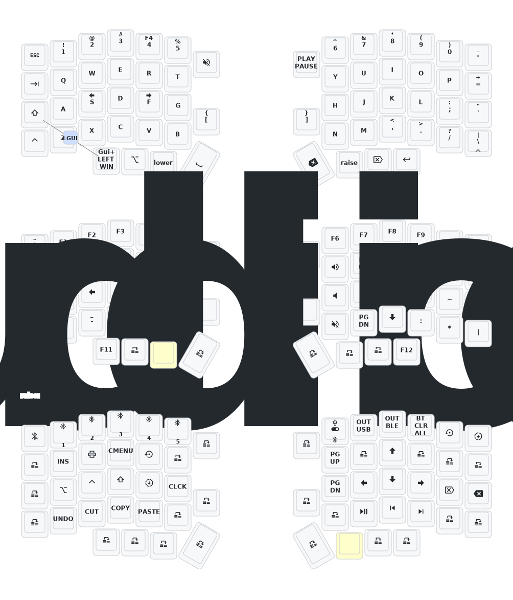

# Lotus58 wireless split keyboard ZMK firmware for nRF52840 nice!nano_v2 and analogues.

Left half is primary. Right half is secondary.
The primary left half connects to the PC, laptop, smartphone, etc via a Type-C cable or via Bluetooth.
The secondary right half connects via USB only for charging.
The halves connect to each other via their own BLE connection.

Support editing keymap:

1. Via https://nickcoutsos.github.io/keymap-editor/ (a more functional solution, but it requires a simple reflash every time.)

2. Via https://zmk.studio/ ZMK Studio(attention: the settings are saved only in the MCU memory and will not survive a firmware update).

## Lotus58 test keymap layout

## Quick Start

## How flash new firmware

1. Fork this repo.

1.1 (Optional) update keymap and config file.

2. Wait github action to build the firmware, then you download and decompress the firmware.zip file.

3. Connect left or right half to your computer with use cable.

4. Left or right half must enter bootloader, you can enter bootloader by
   1) Double-clicking the reset button
   2) Quickly short-circuiting the reset button twice (if the button is not working)
   3) Quickly short-circuiting the GND + RST pins of the controller twice(NOT the VCC 3.3v or RAW 5v pins!) 

5. Copy firmware to your half of keyboard
   1) Filename with 'left' is for the left half of keyboard
   2) Filename with 'right' is for the right half of keyboard
   3) Filename with 'reset' is for the left/right half to forget its bluetooth connection info (when left & right half is not able to connect, to forget paired devices, "hard reset").

## Functions

  - Hold both the left and right tab to enter tri layer, then you can type function keys.
  - =BT_SEL_#= :: select position of bluetooth device you are connecting or want to connect with.
  - =BT_CLR= :: clear the connection on selected position, then you can reconnect to this position with your device.
  - =OUT_TOG= :: toggle between usb and bluetooth connection, so you can connect up to 6 devices (5 with bluetooth, and 1 with usb)
  - =&tog 1= :: toggle windows layer, so you can switch between default and windows layer.
  - =&soft_off= :: enter soft off, like deep sleep which enters after an hour of inactivity, but soft off can only be woke up with wake up keys (set to left thumb key: =shift=)
  - Release your tab keys to return to default or windows layer.
